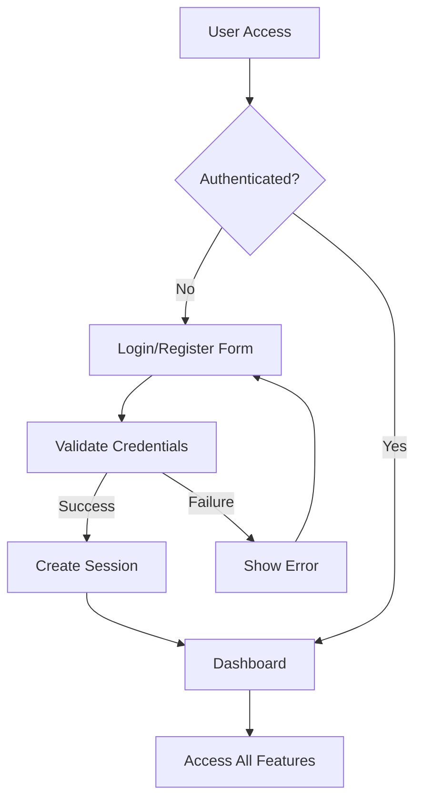
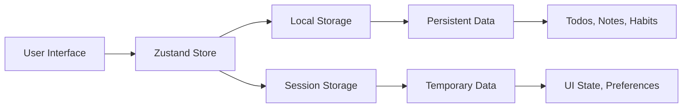
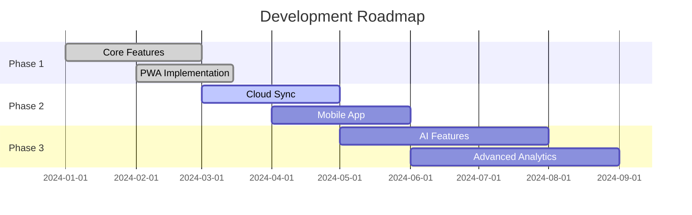

# 🌟 Daily Utility App

<div align="center">


**Your All-in-One Productivity Suite**

*A modern, feature-rich productivity application built with React, TypeScript, and cutting-edge web technologies*

[🚀 Live Demo](#) • [📖 Documentation](#features) • [🛠️ Installation](#installation) • [🤝 Contributing](#contributing)

</div>

---

## 📋 Table of Contents

- [🎯 Overview](#-overview)
- [✨ Features](#-features)
- [🛠️ Tech Stack](#️-tech-stack)
- [📦 Dependencies](#-dependencies)
- [🔐 Authentication](#-authentication)
- [💾 Data Storage](#-data-storage)
- [🎨 UI/UX Design](#-uiux-design)
- [📱 PWA Features](#-pwa-features)
- [🚀 Installation](#-installation)
- [📊 Project Structure](#-project-structure)
- [🗺️ Roadmap](#️-roadmap)
- [📈 Performance](#-performance)
- [🤝 Contributing](#-contributing)
- [📄 License](#-license)

---

## 🎯 Overview

Daily Utility App is a comprehensive productivity suite designed to streamline your daily workflow. Built with modern web technologies, it combines multiple essential tools into one seamless experience, featuring a beautiful interface, offline capabilities, and cross-platform compatibility.

### 🌟 Key Highlights

- **🎨 Modern Design**: Beautiful, responsive UI with dark/light theme support
- **📱 PWA Ready**: Install as a native app on any device
- **🔄 Real-time Sync**: Instant data synchronization across components
- **🔔 Smart Notifications**: Audio alerts with customizable sounds
- **🎯 Productivity Focused**: All essential tools in one place
- **🚀 High Performance**: Optimized for speed and efficiency

---

## ✨ Features

### 📊 Dashboard
- **Overview Analytics**: Visual representation of your productivity metrics
- **Quick Stats**: Real-time counters for tasks, notes, and habits
- **Recent Activity**: Latest updates from all modules
- **Progress Tracking**: Visual progress indicators and trends

### ✅ Todo Management
- **Smart Task Organization**: Priority-based sorting with color coding
- **Reminder System**: Audio notifications with custom sounds
- **Drag & Drop**: Intuitive task reordering
- **Filter & Search**: Advanced filtering options
- **Progress Tracking**: Visual completion indicators

### 📝 Notes System
- **Rich Text Support**: Formatted note creation
- **Category Organization**: Organized note management
- **Color Coding**: Visual categorization
- **Reminder Integration**: Set timed reminders for notes
- **Search Functionality**: Quick note discovery

### 🎯 Habit Tracker
- **Weekly View**: Visual habit tracking calendar
- **Streak Counting**: Automatic streak calculation
- **Progress Analytics**: Habit completion statistics
- **Color Customization**: Personalized habit themes
- **Motivation Metrics**: Achievement tracking

### 🎨 Drawing Pad
- **Digital Canvas**: Full-featured drawing interface
- **Brush Customization**: Multiple brush sizes and colors
- **Eraser Tool**: Precision editing capabilities
- **Save & Export**: Download drawings as images
- **Gallery Management**: Organized drawing storage

### ⏱️ Timer Tools
- **Pomodoro Timer**: Customizable work/break intervals
- **Stopwatch**: Precision time tracking with lap functionality
- **Tap Counter**: Interactive counting tool with targets
- **Audio Alerts**: Sound notifications for timer completion

### 🧮 Calculator
- **Standard Mode**: Basic arithmetic operations
- **Scientific Mode**: Advanced mathematical functions
- **History Tracking**: Calculation history with replay
- **Keyboard Support**: Full keyboard navigation

### 📁 File Manager
- **File Upload**: Drag & drop file management
- **Preview Support**: Image and document previews
- **Search & Filter**: Advanced file discovery
- **Download Options**: Easy file retrieval
- **Storage Analytics**: File size and type statistics

---

## 🛠️ Tech Stack

<div align="center">

### Frontend Framework


### Build Tools


### Styling


### State Management


### Animation


### Routing


### Utilities


</div>

---

## 📦 Dependencies

### 🎯 Core Dependencies

| Package | Version | Purpose | Size |
|---------|---------|---------|------|
| **react** | 18.3.1 | Core React library |  |
| **react-dom** | 18.3.1 | React DOM renderer |  |
| **typescript** | 5.5.3 | Type safety and development experience |  |
| **vite** | 5.4.2 | Build tool and development server |  |

### 🎨 UI & Styling

| Package | Version | Purpose | Size |
|---------|---------|---------|------|
| **tailwindcss** | 3.4.1 | Utility-first CSS framework |  |
| **framer-motion** | 11.0.5 | Animation library |  |
| **lucide-react** | 0.344.0 | Icon library |  |

### 🔧 State & Routing

| Package | Version | Purpose | Size |
|---------|---------|---------|------|
| **zustand** | 4.5.0 | State management |  |
| **react-router-dom** | 6.22.0 | Client-side routing |  |

### 🛠️ Utilities

| Package | Version | Purpose | Size |
|---------|---------|---------|------|
| **date-fns** | 3.6.0 | Date manipulation |  |
| **canvas-sketch** | 0.7.7 | Drawing utilities |  |

---

## 🔐 Authentication

### 🛡️ Security Features

- **Local Authentication**: Secure email/password authentication
- **Session Management**: Persistent login sessions
- **Data Encryption**: Local storage encryption
- **User Profiles**: Customizable user profiles with avatars

### 🔑 Authentication Flow



### 👤 User Management

- **Registration**: Email-based account creation
- **Profile Customization**: Avatar selection and personal info
- **Theme Preferences**: Dark/light mode settings
- **Data Persistence**: Automatic data saving

---

## 💾 Data Storage

### 🗄️ Storage Architecture



### 📊 Data Models

#### Todo Model
```typescript
interface Todo {
  id: string;
  text: string;
  completed: boolean;
  priority: 'high' | 'medium' | 'low';
  color: string;
  createdAt: Date;
  reminder?: {
    enabled: boolean;
    datetime: Date;
    sound: string;
  };
}
```

#### Note Model
```typescript
interface Note {
  id: string;
  title: string;
  content: string;
  color: string;
  category: string;
  createdAt: Date;
  updatedAt: Date;
  reminder?: {
    enabled: boolean;
    datetime: Date;
    sound: string;
  };
}
```

#### Habit Model
```typescript
interface Habit {
  id: string;
  name: string;
  description: string;
  color: string;
  streak: number;
  completedDates: string[];
  createdAt: Date;
}
```

---

## 🎨 UI/UX Design

### 🎯 Design Principles

- **Minimalist Aesthetic**: Clean, uncluttered interface
- **Consistent Branding**: Purple-to-blue gradient theme
- **Responsive Design**: Mobile-first approach
- **Accessibility**: WCAG 2.1 compliant
- **Performance**: Optimized animations and interactions

### 🌈 Color Palette

```css
/* Primary Colors */
--purple-500: #8B5CF6
--blue-500: #3B82F6
--cyan-500: #06B6D4

/* Semantic Colors */
--success: #10B981
--warning: #F59E0B
--error: #EF4444
--info: #3B82F6
```

### 📱 Responsive Breakpoints

| Breakpoint | Width | Target Device |
|------------|-------|---------------|
| `sm` | 640px+ | Mobile (Large) |
| `md` | 768px+ | Tablet |
| `lg` | 1024px+ | Desktop |
| `xl` | 1280px+ | Large Desktop |
| `2xl` | 1536px+ | Ultra-wide |

---

## 📱 PWA Features

### 🚀 Progressive Web App Capabilities

- **Offline Support**: Service worker implementation
- **App Installation**: Add to home screen functionality
- **Push Notifications**: Background notification support
- **App Manifest**: Native app-like experience
- **Caching Strategy**: Intelligent resource caching

### 📋 PWA Checklist

- ✅ HTTPS served
- ✅ Responsive design
- ✅ Service worker registered
- ✅ Web app manifest
- ✅ Offline functionality
- ✅ Fast loading (< 3s)
- ✅ Cross-browser compatibility

---

## 🚀 Installation

### 📋 Prerequisites

- **Node.js**: Version 18.0.0 or higher
- **npm**: Version 8.0.0 or higher
- **Git**: Latest version

### 🛠️ Quick Start

```bash
# Clone the repository
git clone https://github.com/yourusername/daily-utility-app.git

# Navigate to project directory
cd daily-utility-app

# Install dependencies
npm install

# Start development server
npm run dev

# Build for production
npm run build

# Preview production build
npm run preview
```

### 🔧 Development Scripts

| Command | Description |
|---------|-------------|
| `npm run dev` | Start development server |
| `npm run build` | Build for production |
| `npm run preview` | Preview production build |
| `npm run lint` | Run ESLint |

### 🌐 Environment Setup

Create a `.env` file in the root directory:

```env
VITE_APP_NAME=Daily Utility App
VITE_APP_VERSION=1.0.0
VITE_API_URL=http://localhost:3000
```

---

## 📊 Project Structure

```
daily-utility-app/
├── 📁 public/
│   ├── 🖼️ icon-192.png
│   ├── 🖼️ icon-512.png
│   ├── 📄 manifest.json
│   └── ⚙️ sw.js
├── 📁 src/
│   ├── 📁 components/
│   │   ├── 📁 Auth/
│   │   ├── 📁 Calculator/
│   │   ├── 📁 Dashboard/
│   │   ├── 📁 DrawingPad/
│   │   ├── 📁 FileManager/
│   │   ├── 📁 HabitTracker/
│   │   ├── 📁 Layout/
│   │   ├── 📁 Notes/
│   │   ├── 📁 Settings/
│   │   ├── 📁 TimerTools/
│   │   └── 📁 TodoList/
│   ├── 📁 contexts/
│   │   ├── 🔐 AuthContext.tsx
│   │   └── 🎨 ThemeContext.tsx
│   ├── 📁 store/
│   │   └── 🗄️ useStore.ts
│   ├── 📁 types/
│   │   └── 📝 index.ts
│   ├── 🎨 index.css
│   ├── 🚀 main.tsx
│   └── 📱 App.tsx
├── ⚙️ tailwind.config.js
├── ⚙️ vite.config.ts
├── 📝 package.json
└── 📖 README.md
```

---

## 🗺️ Roadmap

### 🎯 Current Version (v1.0.0)
- ✅ Core productivity features
- ✅ PWA implementation
- ✅ Responsive design
- ✅ Local data storage
- ✅ Theme customization

### 🚀 Upcoming Features (v1.1.0)
- 🔄 Cloud synchronization
- 📊 Advanced analytics
- 🤝 Collaboration features
- 📱 Mobile app (React Native)
- 🔌 Third-party integrations

### 🌟 Future Enhancements (v2.0.0)
- 🤖 AI-powered suggestions
- 📈 Advanced reporting
- 🔗 API integrations
- 🌐 Multi-language support
- 🎯 Goal tracking system



---

## 📈 Performance

### ⚡ Performance Metrics

| Metric | Score | Target |
|--------|-------|--------|
| **First Contentful Paint** | < 1.5s | < 2s |
| **Largest Contentful Paint** | < 2.5s | < 4s |
| **Cumulative Layout Shift** | < 0.1 | < 0.1 |
| **First Input Delay** | < 100ms | < 300ms |
| **Bundle Size** | < 500KB | < 1MB |

### 🔧 Optimization Techniques

- **Code Splitting**: Dynamic imports for route-based splitting
- **Tree Shaking**: Unused code elimination
- **Image Optimization**: WebP format with fallbacks
- **Caching Strategy**: Aggressive caching for static assets
- **Lazy Loading**: Component-level lazy loading

---

## 🤝 Contributing

### 🌟 How to Contribute

1. **Fork the repository**
2. **Create a feature branch**: `git checkout -b feature/amazing-feature`
3. **Commit your changes**: `git commit -m 'Add amazing feature'`
4. **Push to the branch**: `git push origin feature/amazing-feature`
5. **Open a Pull Request**

### 📋 Contribution Guidelines

- Follow the existing code style
- Write meaningful commit messages
- Add tests for new features
- Update documentation as needed
- Ensure all tests pass

### 🐛 Bug Reports

Please use the [issue tracker](https://github.com/yourusername/daily-utility-app/issues) to report bugs.

---

## 📄 License

This project is licensed under the MIT License - see the [LICENSE](LICENSE) file for details.

---

<div align="center">

### 🌟 Star this repository if you found it helpful!

**Made with ❤️ using [Bolt.new](https://bolt.new)**


</div>

---

## 📞 Support

- 📧 **Email**: support@dailyutility.app
- 💬 **Discord**: [Join our community](https://discord.gg/dailyutility)
- 🐦 **Twitter**: [@DailyUtilityApp](https://twitter.com/DailyUtilityApp)
- 📖 **Documentation**: [docs.dailyutility.app](https://docs.dailyutility.app)

---

*Last updated: December 2024*
